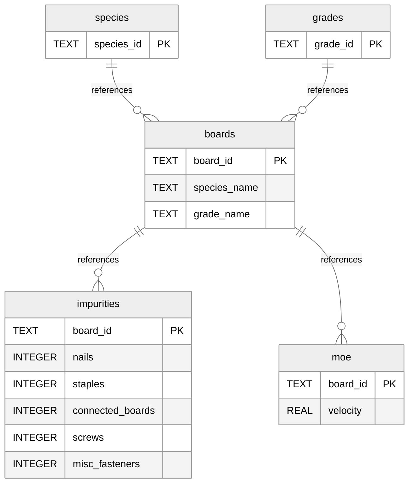
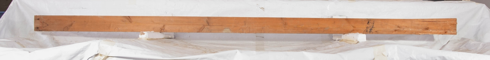
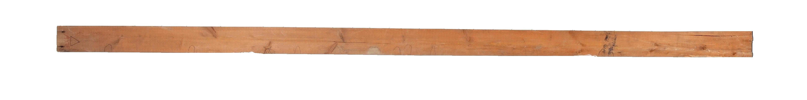

# RCLT (Recycled Cross-Laminated Timber)
   

## Introduction
This repository encompasses my work as a research assistant under Dr. Julie Cool and Dr. Minghao Li, working on evaluting the feasibility of using recycled (pre-stressed) wood in structural applications.

The primary goal of this study is to support the path to standardization and code compliance of reclaimed wood, by evaluating performance metrics and creating standardized testing protocols.

The secondary goal of this study is to create a machine learning model trained on the results of the structural tests in correlation to the defects and characteristics of the reclaimed wood samples. This model should be able to predict an ideal use case of a reclaimed wood sample from a set of input conditions.

## Database
The central database for this project uses SQLite 3.51.1, but some initial data entry was done in Microsoft Access before being ported over.

SQLite was chosen since it is natively supported in the Python Standard Library

## CV Model

### Background Removal & Batch Processing
To process the board photos (taken on a Sony A7Siii in a controlled environment), OpenCV and Rembg were used to isolate the subject from our makeshift photo studio.

Raw photo (A120)

Processed photo (A120)

Further processing for edge case scenarios where the script did not accurately isolate the subject was done in Adobe Photoshop 2026 using a variety of masking tools.
